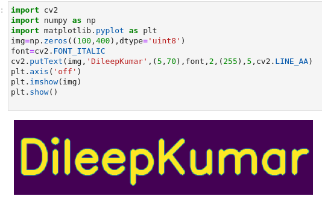
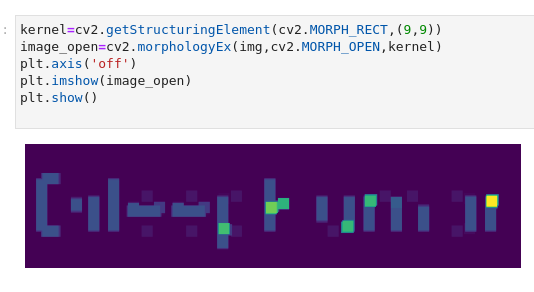
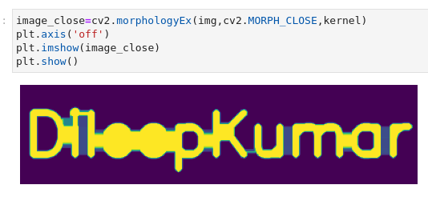

# Opening-and-Closing

## Aim
To implement Opening and Closing using Python and OpenCV.

## Software Required
1. Anaconda - Python 3.7
2. OpenCV
## Algorithm:
### Step1:
Import the necessary packages.


### Step2:
Create the Text using cv2.putText

### Step3:
Create the structuring element.

### Step4:
Use Opening operation.

### Step5:
Use Closing Operation.

 
## Program:
### Developed by: Gumma Dileep Kumar
### Register No: 212222240032


# Import the necessary packages
```python
import cv2
import numpy as np
import matplotlib.pyplot as plt

```


# Create the Text using cv2.putText
```python
img=np.zeros((100,400),dtype='uint8')
font=cv2.FONT_ITALIC
cv2.putText(img,'DileepKumar',(5,70),font,2,(255),5,cv2.LINE_AA)
plt.axis('off')
plt.imshow(img)
plt.show()
```


# Create the structuring element
```python
kernel=cv2.getStructuringElement(cv2.MORPH_RECT,(9,9))
```


# Use Opening operation
```python
image_open=cv2.morphologyEx(img,cv2.MORPH_OPEN,kernel)
plt.axis('off')
plt.imshow(image_open)
plt.show()
```
# Use Closing Operation
```python
image_close=cv2.morphologyEx(img,cv2.MORPH_CLOSE,kernel)
plt.axis('off')
plt.imshow(image_close)
plt.show()
```
## Output:

## Display the input Image


## Display the result of Opening


## Display the result of Closing


## Result
Thus the Opening and Closing operation is used in the image using python and OpenCV.